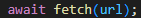

        # Projeto de cadastro de Endereço com consumo da API (ViaCEP)

## ÍNDICE 

* [Introdução](#introdução)
* [Descrição](#descrição)
* [Funcionalidades](#funcionalidades)
* [Resultado](#resultado)
* [Fontes](#fontes)
* [Autores](#autores)

## Introdução

Neste trabalho, apresentaremos o projeto do Cadastro de Endereço que desenvolvemos juntos durante as aulas junto com o professor. Esta atividade tem o intuito de aprimorar nossas habilidades de programação e colaboração.

## Descrição

Neste projeto vamos utilizar uma [API](https://viacep.com.br/) que irá servir para resgatar as informações válidas do CEP de todo Brasil, para preencher o formulário automaticamente.

`Fuções novas utilizados no código: Recursos de consumo a API`

* ### `Await`

Uma função assíncrona pode conter uma expressão `await`, que pausa a execução da função assíncrona e espera pela resolução da Promise passada, e depois retoma a execução da função assíncrona e retorna o valor resolvido.

* ### `Fetch`

O método global `fetch` inicia o processo de busca de um recurso da rede, retornando uma promessa que é cumprida assim que a resposta estiver disponível.
A promessa é resolvida para o objeto Response que representa a resposta à sua solicitação. A promessa não rejeita erros de HTTP - apenas rejeita erros de rede. Você deve usar os manipuladores then para chechar erros de HTTP.

* ### `Async`

Quando uma função assíncrona é chamada, ela retorna uma Promise. Quando a função assíncrona retorna um valor, a Promise será resolvida com o valor retornado. Quando a função assíncrona lança uma exceção ou algum valor, a Promise será rejeitada com o valor lançado.
Uma função assíncrona pode conter uma expressão await, que pausa a execução da função assíncrona e espera pela resolução da Promise passada, e depois retoma a execução da função assíncrona e retorna o valor resolvido.

* ### `addres`

O elemento HTML `address` fornece informações de contato para seu ancestral "article" ou "body" mais próximo; no segundo caso, ele se aplica ao documento inteiro.
A informação de contato fornecida por um conteúdo do elemento `address` pode tomar qualquer forma que é apropriada para o contexto, e pode incluir qualquer tipo de informação de contato necessária, como endereço físico, URL, email, telefone, mídia social, coordenadas geográficas, por aí vai. Deve incluir o nome da pessoa, grupo, ou organização para qual as informações de contato se referem.

`Descrevendo o código utilizado na JavaScript`

* `Modo Estrito:` O código começa com "use strict";, que ativa um modo que ajuda a evitar erros comuns e melhora a segurança do código.

* `Limpar Formulário:` A função "limparFormulario" é responsável por limpar todos os campos do formulário antes de preenchê-los com novos dados.

### `Validação do CEP:`

* `eNumero` verifica se a string é composta apenas por números.

* `cepValido` garante que o CEP tenha exatamente 8 dígitos numéricos.

* `Preenchimento do Formulário:` A função "preencherFormulario" recebe um objeto de endereço e preenche os campos do formulário com os dados recebidos da API.

### `Consumo da API: A função pesquisarCep:`

Chama "limparFormulario" para iniciar com campos vazios.

Verifica se o CEP é válido. Se for, faz uma requisição à "API ViaCEP" para obter os dados do endereço.

Se o CEP for encontrado, usa "preencherFormulario" para exibir os dados. Caso contrário, exibe um alerta informando que o CEP não foi encontrado.

`Escutador de Eventos:` O código adiciona um evento ao campo de entrada do CEP, que chama a função "pesquisarCep" quando o campo perde o foco (focusout).

Essencialmente, o script permite ao usuário inserir um CEP e automaticamente preencher o formulário com os dados do endereço correspondente, melhorando a experiência do usuário ao evitar a entrada manual de informações.

## Funcionalidades 

O código permite preencher automaticamente um formulário de endereço com base no CEP informado pelo usuário. Ao sair do campo de CEP, ele faz uma requisição à API ViaCEP. Se o CEP for válido, os dados do endereço são preenchidos; caso contrário, um alerta informa sobre o erro. Isso simplifica o processo de preenchimento de formulários.

## Resultado

## Fontes
[Mdn Web Docs](https://developer.mozilla.org/pt-BR/)

[Chat GPT](https://chatgpt.com/)

## Autores 
[Leonardo Rocha](https://github.com/LeonardoRochaMarista)

[Manuela Araujo dos Santos](https://github.com/manuelaaraujo)